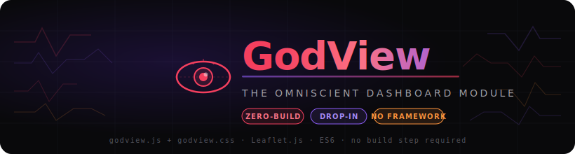
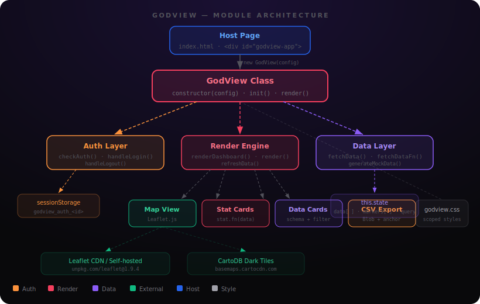
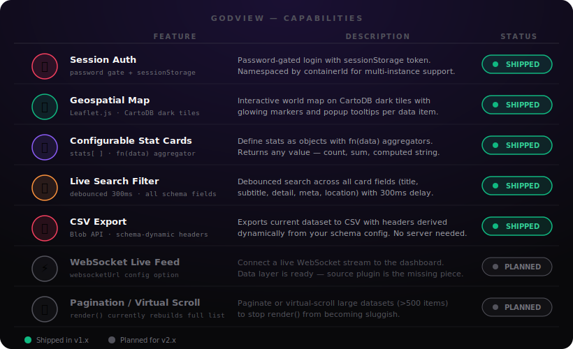
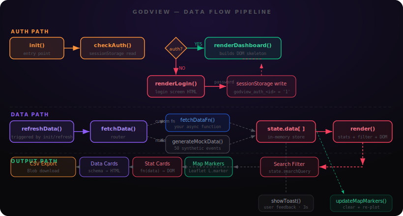
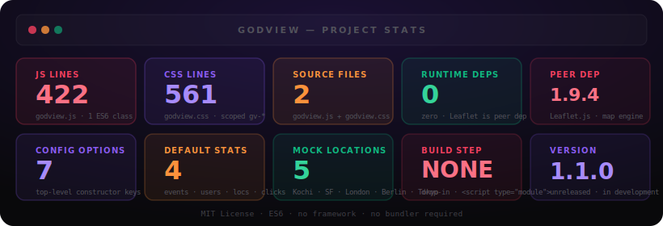

<div align="center">



</div>

**Drop a `<div>` in. Get a full monitoring dashboard out. No build step, no framework, no regrets.**

[Features](#features) • [Installation](#installation) • [Usage](#usage) • [Architecture](#architecture) • [Roadmap](#roadmap) • [License](#license)

---

*I kept reaching for a dashboard module that didn't require a Node install, a webpack config, or a React subscription. Something I could drop into any project and have running in five minutes. GodView is that thing — two files, one peer dep, infinite containers.*

GodView is a zero-build, drop-in ES6 dashboard module that turns any `<div>` into a glassmorphic monitoring interface. It handles auth, geospatial mapping via Leaflet.js, configurable stat cards with custom aggregation functions, live search, and CSV export — all without a build step, a framework, or a runtime dependency beyond Leaflet itself. You define the schema and the data source; it assembles the UI.

---

[](https://developer.mozilla.org/en-US/docs/Web/JavaScript/Guide/Modules)
[](https://leafletjs.com/)
[](./src/godview.js)
[](https://caniuse.com/es6-module)
[](./LICENSE)
[](./index.html)

---

## System Overview

GodView is a single ES6 class (`GodView`) split across two files: `godview.js` for all module logic and `godview.css` for scoped styles. The class owns its entire lifecycle — auth, rendering, data fetching, map management, and export — with no external state management and no virtual DOM. You instantiate it on a container element; it builds everything inside that element and tears it down cleanly on logout.

```text
GodView/
├── src/
│   ├── godview.js      # 422-line ES6 class — the whole show
│   └── godview.css     # 561-line scoped stylesheet (--gv-* CSS variables)
├── wiki/               # full documentation suite (arch, usage, privacy, roadmap)
├── assets/             # SVG diagrams, demo assets
├── index.html          # runnable demo page (53 lines)
├── CONTRIBUTING.md
├── SECURITY.md
└── LICENSE
```



The architecture is deliberately flat: one class, three internal subsystems (Auth, Render, Data), and two external touch points (Leaflet for mapping, CartoDB for map tiles). There are no event buses, no pub/sub, no dependency injection. If you can read a JavaScript class, you can read GodView.

---

## Features

| Feature | What it actually does |
|---|---|
| 🔒 **Session Auth** | Shows a glassmorphic login screen, validates against `config.password`, writes a namespaced token to `sessionStorage`. Multiple GodView instances on the same page have independent auth states. Token dies with the tab. |
| 🗺️ **Geospatial Map** | Initializes a Leaflet map on CartoDB dark tiles. Plots a custom glowing `L.divIcon` marker for each data item that has `lat`/`lng` fields. Applies ±0.005° jitter to prevent marker pile-ups. |
| 📊 **Configurable Stat Cards** | Define stats as `{ id, label, color, icon, fn }` objects. `fn(data)` receives the full dataset and returns any value — count, sum, string, emoji. The rendered value is just `textContent`. |
| 🔎 **Live Search** | Debounced 300ms full-text filter across `title`, `subtitle`, `detail`, `meta`, and `location` fields. Doesn't re-fetch data — filters `state.data` in memory. |
| 🗂️ **Flexible Schema** | Maps your data's actual field names (or transform functions) to GodView's display roles. `schema.title: 'username'` or `schema.meta: (item) => item.status` — both work via `getVal()`. |
| 📥 **CSV Export** | Generates a Blob from the current dataset with headers derived dynamically from your schema config. Triggers a browser download. No server, no temp files. |
| 🔄 **Refresh Button** | Re-calls `fetchDataFn` (or the mock generator), updates stat cards and map markers, shows a toast confirmation. |
| 🍞 **Toast Notifications** | 3-second overlay messages for sync confirmations and export completions. Appended to the dashboard container, scoped away from the rest of the page. |
| 🎨 **CSS Custom Properties** | All visual tokens (`--gv-primary`, `--gv-bg-card`, `--gv-radius-md`, etc.) declared as CSS variables. Override any token without touching the source file. |

---

## Capability Visualization



---

## Architecture


GodView runs entirely in the browser's main thread — there are no web workers, no service workers, and no background processes. The `GodView` class constructor synchronously parses config and grabs the container element. `init()` is the only async entry point; it routes to either `renderLogin()` or `renderDashboard()` based on `sessionStorage` state.

The render pipeline is intentionally non-reactive. When data changes, `render()` recalculates all stat card values, applies the current search filter, and rebuilds the entire card list via `innerHTML` assignment. This is fast enough for hundreds of records and eliminates the complexity of diffing or fine-grained DOM updates. For datasets exceeding ~500 items, pagination is the planned solution (see [Roadmap](#roadmap)).

The map layer is initialized 100ms after `renderDashboard()` to ensure the DOM has painted before Leaflet tries to measure the container. Leaflet is checked at runtime via `typeof L === 'undefined'` — if it's not loaded, the map area degrades gracefully rather than throwing.

---

## Data Flow



Primary data path — from init to rendered cards:

```
init()
  └─ checkAuth()                     ← reads sessionStorage
       ├─ [no token] renderLogin()   ← password input → handleLogin() → write token
       └─ [token]    renderDashboard()
                       └─ refreshData()
                            └─ fetchData()
                                 ├─ config.fetchDataFn()   ← your async function
                                 └─ generateMockData(50)   ← fallback
                            └─ state.data = result
                            └─ render()
                                 ├─ stat.fn(data) → stat card values
                                 ├─ filter by state.searchQuery
                                 └─ card list → listEl.innerHTML
                            └─ updateMapMarkers()
                                 └─ clear markers → re-plot lat/lng items
```

---

## Installation

> **Requirements:** A modern browser with ES6 module support. Leaflet 1.9.4 loaded before GodView. That's it.

**1. Copy the source files into your project**

```bash
# From the repo — copy these two files wherever makes sense for your project
src/godview.js
src/godview.css
```

No npm install. No `package.json`. No bundler required. These are just files.

**2. Add Leaflet to your HTML** — Leaflet handles the map layer. It must load before GodView initializes.

```html
<!-- In <head> -->
<link rel="stylesheet" href="https://unpkg.com/leaflet@1.9.4/dist/leaflet.css" />

<!-- Before </body> or with defer -->
<script src="https://unpkg.com/leaflet@1.9.4/dist/leaflet.js"></script>
```

> **Pro tip:** If you don't want CDN calls, [self-host Leaflet](https://leafletjs.com/download.html) and swap the URLs. Same for the Outfit font import in `godview.css` — remove the `@import` and fall back to `system-ui` if you want zero external requests.

**3. Add GodView CSS**

```html
<link rel="stylesheet" href="./path/to/godview.css" />
```

**4. Add a container element**

```html
<div id="godview-app"></div>
```

**5. Initialize**

```html
<script type="module">
  import { GodView } from './path/to/godview.js';

  const app = new GodView({
    containerId: 'godview-app',
    password: 'demo',
    title: 'System Overwatch',
    logo: '👁️'
  });

  app.init();
</script>
```

| Platform | Notes |
|---|---|
| Static HTML | Works as-is. Open `index.html` directly in a browser or serve via any static file server. |
| Vite / Parcel | Import `GodView` normally — ES module, no special config needed. |
| webpack | Works with `type: 'module'` or standard `import`. No loader required. |
| CDN/iframe embed | Copy files, reference them relatively or absolutely. No registry needed. |

> **CSS variables note:** The default `godview.css` scopes variables to `#godview-container`. If your `containerId` is different (e.g., `#app`), either update that selector in `godview.css` or redeclare the `--gv-*` variables on your container element.

---

## Usage

**1. Open `index.html` in a browser** (or any page where you've completed the installation steps above).

**2. Enter the password** you passed as `config.password`. The default in the demo is `demo`.

**3. The dashboard loads.** Mock data is generated automatically if you don't provide `fetchDataFn`. You'll see stat cards, a world map with markers, and a card stream.

**4. Plug in your data** by providing a `fetchDataFn`:

```javascript
const app = new GodView({
  containerId: 'godview-app',
  password: 'internal-only',
  title: 'API Monitor',

  fetchDataFn: async () => {
    const res = await fetch('/api/events');
    return res.json();
  },

  schema: {
    title:    'endpoint',
    subtitle: 'method',
    detail:   'message',
    meta:     'status_code',
    date:     'timestamp',
    location: 'region',
    lat:      'geo_lat',
    lng:      'geo_lng',
    clicks:   (item) => item.request_count
  },

  stats: [
    { id: 'total',  label: 'Requests',    color: 'pink',   icon: '📡', fn: (d) => d.length },
    { id: 'errors', label: 'Errors',      color: 'purple', icon: '🔥', fn: (d) => d.filter(i => i.status_code >= 400).length },
    { id: 'p99',    label: 'P99 Latency', color: 'blue',   icon: '⚡', fn: (d) => {
      const sorted = d.map(i => i.latency_ms).sort((a, b) => a - b);
      return sorted[Math.floor(sorted.length * 0.99)] + 'ms';
    }}
  ]
});

app.init();
```

**5. Use the Refresh button** to re-call `fetchDataFn` and sync the latest data.

**6. Filter with the search box** — searches across all displayed fields in real time (300ms debounce).

**7. Export to CSV** with the 📥 button — downloads a CSV using your schema's field names as headers.

> **Pro tip:** You can run multiple GodView instances on the same page with different `containerId` values. Auth is scoped per instance — logging out of one doesn't affect the other.

---

## Project Structure

```text
GodView/
├── 📄 src/
│   ├── godview.js       # ES6 class (422 lines) — auth, render, data, map, export
│   └── godview.css      # scoped styles (561 lines) — all --gv-* CSS variables
│
├── 📖 wiki/
│   ├── Home.md          # wiki entry point
│   ├── Architecture.md  # module internals deep dive
│   ├── Installation.md  # step-by-step setup guide
│   ├── Usage.md         # full config reference and examples
│   ├── Privacy.md       # external service inventory
│   ├── Troubleshooting.md
│   └── Roadmap.md       # planned features with status
│
├── 🖼️ assets/
│   ├── hero-banner.svg  # README hero graphic
│   ├── architecture.svg # module architecture diagram
│   ├── data-flow.svg    # data pipeline diagram
│   ├── capabilities.svg # feature matrix
│   ├── stats.svg        # project metrics dashboard
│   └── banner.svg       # legacy banner
│
├── 🌐 index.html        # runnable demo (53 lines) — open and enter "demo"
├── CHANGELOG.md         # version history
├── CONTRIBUTING.md
├── SECURITY.md
└── LICENSE              # MIT
```

---

## Performance Stats



---

## Privacy

GodView is client-side only. It does not log, transmit, or persist your data beyond the browser tab.

**What GodView stores:**
- `sessionStorage` key `godview_auth_<containerId>` — a `'1'` flag written on successful login. Contains no user data. Deleted on logout or tab close.

**External requests made at page load** (all avoidable via self-hosting):

| Service | Why | Self-hostable? |
|---|---|---|
| `unpkg.com/leaflet@1.9.4` | Map engine script | ✅ Download from leafletjs.com |
| `fonts.googleapis.com` (Outfit) | UI font | ✅ Remove `@import` from godview.css |
| `basemaps.cartocdn.com` | Dark map tile images | ✅ Swap tile URL in `initMap()` |

**Your `fetchDataFn`** calls whatever URL you point it at. That's your network; GodView doesn't touch it beyond calling the function you provide.

The password in `config.password` is a JavaScript property in memory — visible to anyone with DevTools access. It's a light access gate, not a security boundary. See [wiki/Privacy.md](./wiki/Privacy.md) for the full breakdown.

---

## Roadmap

### Quality of Life (v1.x)
- [ ] Pagination for large datasets — `render()` rebuilds the full list; for >500 items this gets sluggish
- [ ] Skeleton loading states — "Syncing..." text works but looks unfinished
- [ ] Date range filter — start/end inputs to slice the card stream by time
- [ ] `localStorage` auth option — `persist: true` config so auth survives a page refresh
- [ ] Dark/light theme toggle — parallel CSS variable set for light-mode users

### Feature Expansion (v2.x)
- [ ] WebSocket live feed — `websocketUrl` config feeding a live stream into the dashboard
- [ ] Pluggable chart widgets — line/bar/pie beyond simple stat cards
- [ ] Multiple marker styles — configurable shape/color/size per item property
- [ ] Leaflet marker clustering — group nearby markers using `leaflet.markercluster`
- [ ] Column sort on card list — click to sort by date, meta, location, etc.

### Distribution
- [ ] npm package — ESM + CJS build targets for package manager installs
- [ ] CDN distribution — hosted on unpkg/jsDelivr for `<script src>` installs

### Won't Do
- ❌ React/Vue/Svelte wrappers — framework adapters would be separate projects
- ❌ Backend / server component — GodView is intentionally client-only
- ❌ IE11 support — we use `class`, `async/await`, and CSS custom properties

---

## Contributing

Open an issue first to discuss the approach before building. PRs without prior discussion have a higher chance of being declined if the design doesn't fit.

See [CONTRIBUTING.md](./CONTRIBUTING.md) for the full guide.

---

## Security

For responsible disclosure of security vulnerabilities, see [SECURITY.md](./SECURITY.md).

---

## License

MIT © [Kaelith69](https://github.com/Kaelith69) — built because dashboards shouldn't require a PhD in webpack.
